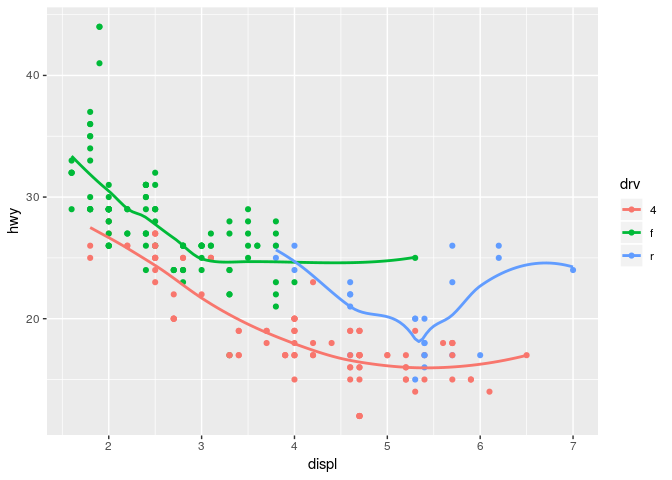
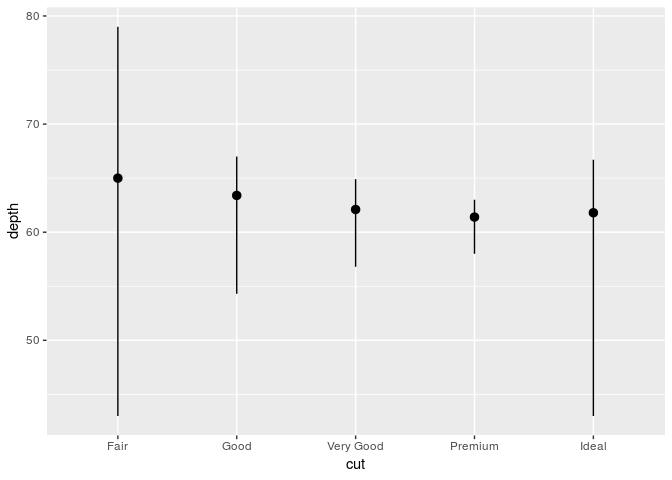

Homework 2: ggplot
================
2019-03-08

``` r
library(tidyverse)
```

    ## ── Attaching packages ──────────────────────────────────────────────────────────────────────────── tidyverse 1.2.1 ──

    ## ✔ ggplot2 3.1.0       ✔ purrr   0.3.1  
    ## ✔ tibble  2.0.1       ✔ dplyr   0.8.0.1
    ## ✔ tidyr   0.8.3       ✔ stringr 1.4.0  
    ## ✔ readr   1.3.1       ✔ forcats 0.4.0

    ## ── Conflicts ─────────────────────────────────────────────────────────────────────────────── tidyverse_conflicts() ──
    ## ✖ dplyr::filter() masks stats::filter()
    ## ✖ dplyr::lag()    masks stats::lag()

  - Take the first faceted plot in this section:

<!-- end list -->

``` r
ggplot(data = mpg) + 
  geom_point(mapping = aes(x = displ, y = hwy)) + 
  facet_wrap(~ class, nrow = 2)
```

<!-- -->

What are the advantages to using faceting instead of the colour
aesthetic? What are the disadvantages? How might the balance change if
you had a larger dataset?

  - Recreate the R code necessary to generate the following
graphs.

<!-- end list -->

``` r
knitr::include_graphics(paste0("plots/fig", 1:6, ".png"))
```


``` r
ggplot(data = mpg, mapping = aes(x = displ, y = hwy)) + 
  geom_point() + 
  geom_smooth(se = FALSE)
```

    ## `geom_smooth()` using method = 'loess' and formula 'y ~ x'

<!-- -->

``` r
ggplot(data = mpg, mapping = aes(x = displ, y = hwy, group = drv)) + 
  geom_point() + 
  geom_smooth(se = FALSE)
```

    ## `geom_smooth()` using method = 'loess' and formula 'y ~ x'

<!-- -->

``` r
ggplot(data = mpg, mapping = aes(x = displ, y = hwy, color = drv)) + 
  geom_point() + 
  geom_smooth(se = FALSE)
```

    ## `geom_smooth()` using method = 'loess' and formula 'y ~ x'

<!-- -->

``` r
ggplot(data = mpg) + 
  geom_point(mapping = aes(x = displ, y = hwy, color = drv)) + 
  geom_smooth(mapping = aes(x = displ, y = hwy), se = FALSE)
```

    ## `geom_smooth()` using method = 'loess' and formula 'y ~ x'

<!-- -->

``` r
ggplot(data = mpg) + 
  geom_point(mapping = aes(x = displ, y = hwy, color = drv)) + 
  geom_smooth(mapping = aes(x = displ, y = hwy, linetype = drv), se = FALSE)
```

    ## `geom_smooth()` using method = 'loess' and formula 'y ~ x'

<!-- -->

``` r
ggplot(data = mpg) + 
  geom_point(mapping = aes(x = displ, y = hwy, fill = drv), shape = 21, color = "white", stroke = 2)
```

<!-- -->

  - Most geoms and stats come in pairs that are almost always used in
    concert. Read through the documentation and make a list of all the
    pairs. What do they have in common?

  - Compare and contrast geom\_jitter() with geom\_count().

<!-- end list -->

``` r
?geom_jitter
?geom_count
```

  - What does the plot below tell you about the relationship between
    city and highway mpg (fuel consumption)? they are coorespond Why is
    coord\_fixed() important? coordinates X = Y What does geom\_abline()
    do?

These geoms add reference lines (sometimes called rules) to a plot,
either horizontal, vertical, or diagonal (specified by slope and
intercept). These are useful for annotating plots.

``` r
ggplot(data = mpg, mapping = aes(x = cty, y = hwy)) +
  geom_point() + 
  geom_abline() +
  coord_fixed()
```

<!-- -->

  - What is the default geom associated with stat\_summary()?
    geom\_pointrange

<!-- end list -->

``` r
ggplot(data = diamonds) + 
  stat_summary(
    mapping = aes(x = cut, y = depth),
    fun.ymin = min,
    fun.ymax = max,
    fun.y = median
  )
```

<!-- -->

How could you rewrite the previous plot to use that geom function
instead of the stat function?

``` r
ggplot(data = diamonds) + 
  geom_errorbar(mapping = aes(x = cut, y = depth),
    ymin = 0,
    ymax = 10
  )
```

    ## Warning: Ignoring unknown aesthetics: y

<!-- -->

  - What does geom\_col() do? How is it different to geom\_bar()? There
    are two types of bar charts: geom\_bar() and geom\_col().
    geom\_bar() makes the height of the bar proportional to the number
    of cases in each group (or if the weight aesthetic is supplied, the
    sum of the weights). If you want the heights of the bars to
    represent values in the data, use geom\_col() instead. geom\_bar()
    uses stat\_count() by default: it counts the number of cases at each
    x position. geom\_col() uses stat\_identity(): it leaves the data as
    is.
  - What variables does stat\_smooth() compute? What parameters control
    its behaviour? Aids the eye in seeing patterns in the presence of
    overplotting. geom\_smooth() and stat\_smooth() are effectively
    aliases: they both use the same arguments. Use stat\_smooth() if you
    want to display the results with a non-standard geom
  - In our proportion bar chart, we need to set group = 1. Why? In other
    words what is the problem with these two graphs? Every proportion =
    1

<!-- end list -->

``` r
diamonds
```

    ## # A tibble: 53,940 x 10
    ##    carat cut       color clarity depth table price     x     y     z
    ##    <dbl> <ord>     <ord> <ord>   <dbl> <dbl> <int> <dbl> <dbl> <dbl>
    ##  1 0.23  Ideal     E     SI2      61.5    55   326  3.95  3.98  2.43
    ##  2 0.21  Premium   E     SI1      59.8    61   326  3.89  3.84  2.31
    ##  3 0.23  Good      E     VS1      56.9    65   327  4.05  4.07  2.31
    ##  4 0.290 Premium   I     VS2      62.4    58   334  4.2   4.23  2.63
    ##  5 0.31  Good      J     SI2      63.3    58   335  4.34  4.35  2.75
    ##  6 0.24  Very Good J     VVS2     62.8    57   336  3.94  3.96  2.48
    ##  7 0.24  Very Good I     VVS1     62.3    57   336  3.95  3.98  2.47
    ##  8 0.26  Very Good H     SI1      61.9    55   337  4.07  4.11  2.53
    ##  9 0.22  Fair      E     VS2      65.1    61   337  3.87  3.78  2.49
    ## 10 0.23  Very Good H     VS1      59.4    61   338  4     4.05  2.39
    ## # … with 53,930 more rows

``` r
ggplot(data = diamonds) + 
  geom_bar(mapping = aes(x = cut, y = ..prop..))
```

<!-- -->

``` r
ggplot(data = diamonds) + 
  geom_bar(mapping = aes(x = cut, fill = color, y = ..prop..))
```

<!-- -->

``` r
ggplot(data = diamonds) + 
  geom_bar(mapping = aes(x = cut, fill = color), position = "fill")
```

<!-- -->
